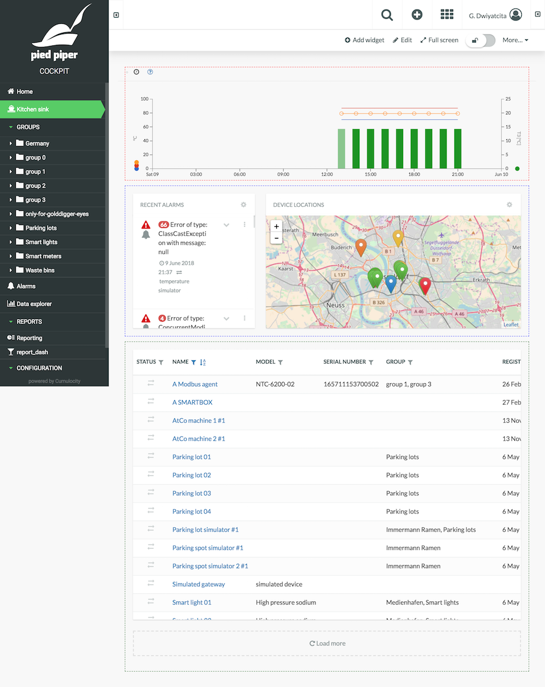

# cumulocity-kitchensink

[](https://www.npmjs.com/package/cumulocity-kitchensink)
[](http://npm-stat.com/charts.html?package=cumulocity-kitchensink)
[](https://raw.githubusercontent.com/dwiyatci/cumulocity-kitchensink/master/LICENSE.txt)

A "kitchen sink" container app for showcasing the usage of some "advanced" Cumulocity UI services and components, as well as revealing the mechanics to extend/adapt the default applications.



### Why?
Make less effort to answer repeated questions. Care less about that "pebbles and sands" bombardment. Come to the office later, go home sooner. Travel places, give more meaning to life, fill my obituary with the values that truly matter.

## Installation
- Make sure you have Node.js ≥ v8.9.0 installed and npm from its [website](https://nodejs.org), or better even, use [nvm](https://github.com/creationix/nvm).

- Install [yarn](https://yarnpkg.com/en/docs/install).

- Clone the repo, `cd` to your project directory.

- Adapt the UI build version you want to develop against:
```bash
$ c8y install [ui_build_version]
```

- Install dependencies:
```bash
$ yarn install:clean
```

## Usage
- Create new plugins or update existing ones under `plugins` directory.

- In the [target file](targets/kitchensink.json), plugins can be added, removed, or replaced from the default applications (i.e. Administration, Device management, and Cockpit) by using `addImports`, `removeImports`, and `replaceImports` respectively.

- Start your development server by using either of the two following commands:
  - `c8y server -u <your_tenant_url> -k -t kitchensink`.
  - `yarn start <your_tenant_url>`.

## Build
```bash
$ c8y build:target kitchensink
```

## Unit testing
Not provided. **BAD** dog. 📛🐶
```bash
$ npm t
```

## Author
Glenn Dwiyatcita ([@dwiyatci](http://tiny.cc/dwiyatci))

## License
MIT.

See [LICENSE.txt](LICENSE.txt).
